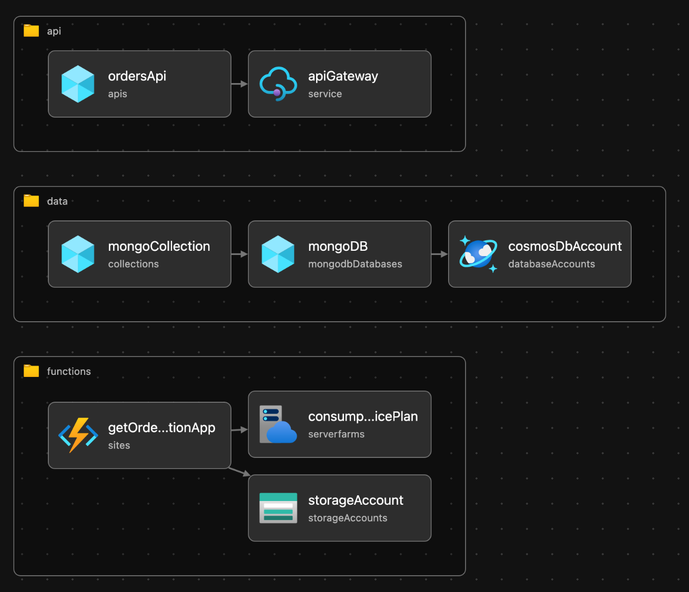

# Bicep Flex 💪

This is an example project which deploys infrastucture using Azure Bicep.

This is a simple starter project which will deploy the following resources to Azure:

- Azure API Gateway (Consumption tier)

  This publishes the API to the internet and upholds the API contract defined in `bicep-flex/orders-openapi.yaml`.

- Azure CosmosDB (MongoDB API)

  This is a minimal SKU Cosmos which is used to demonstrate functionality within the Orders API

- Azure Function (Consumption tier)

  A basic JavaScript Azure Function which connects to the Azure CosmosDB data source for CRUD operations

- Azure Blob Storage

  A blob storage account, required as a dependency of Azure Functions.

## Azure Bicep

As the focus of this repository is to demonstrate Azure Bicep, the Infrastructure as code templates can be reviewed in `infrastucture` directory. The below images demonstrates the Bicep modules structure which has been defined.



## Installation

Install project dependencies using Yarn

```bash
yarn
```

## Prerequisites

You will need to install the Azure CLI, and dependencies of [Azure Bicep.](https://learn.microsoft.com/en-us/azure/azure-resource-manager/bicep/install)

## Deploying

To deploy the infrastucture to Azure.

```bash
./deploy.sh
```

To deploy the Azure Functions code, run

```bash
./release.sh
```
